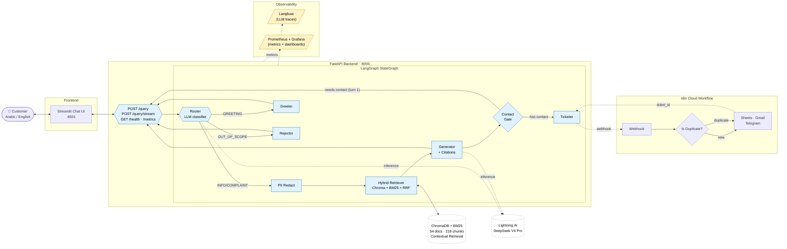
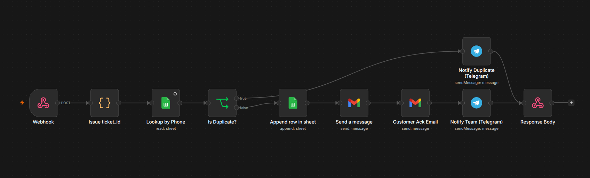

# NileTel RAG Customer Support System

> Bilingual (Egyptian Arabic + English) Retrieval-Augmented Generation system for a fictional Egyptian telecom — routes customer queries, grounds answers in a 54-doc knowledge base, and auto-creates support tickets via n8n.

**Author** — Omar Gamal ElKady · ITI Advanced AI Program · Intake 46 · May 2026
**Stack** — FastAPI · LangGraph · LangChain · ChromaDB + BM25 + RRF · DSPy · RAGAS · Streamlit · n8n · Docker

[](https://github.com/OmarGamal488/niletel-rag-support/actions/workflows/ci.yml)
[](https://github.com/OmarGamal488/niletel-rag-support/actions/workflows/release.yml)


---

## Demo

https://github.com/user-attachments/assets/44dfaf3c-f51e-4d2f-9324-37ae04f00701

A short walkthrough showing all four query types (INFO / COMPLAINT / GREETING / OUT_OF_SCOPE), the bilingual Egyptian-Arabic + English answers, source-card citations, and the COMPLAINT → n8n round-trip that creates a Google Sheets ticket plus customer + agent emails and a Telegram team alert.

## What it does

A user asks a question in Arabic or English. The system:

1. **Classifies** the intent — `INFO`, `COMPLAINT`, `GREETING`, or `OUT_OF_SCOPE`.
2. **Retrieves** relevant policy / FAQ / troubleshooting chunks from the NileTel knowledge base using hybrid search (dense + BM25 + RRF).
3. **Generates** a grounded answer with inline citations, in the same language as the question.
4. **For complaints**, collects contact info over two conversational turns, then opens a ticket through an n8n workflow that:
   - assigns a `TICKET-XXXX` id,
   - appends a row to Google Sheets,
   - emails the support agent + customer,
   - posts to a Telegram team channel,
   - detects duplicate complaints (same phone) and routes them to a separate alert.

## Architecture



## n8n Automation Workflow

When the LangGraph ticketer fires, it POSTs to a cloud n8n workflow that handles ticket persistence, dual email notifications, Telegram alerts, and duplicate detection in nine nodes:



| # | Node | Role |
|---|---|---|
| 1 | **Webhook** | Receives POST from `src/ticketer.py` |
| 2 | **Issue ticket_id** (Code) | Generates `TICKET-XXXXXXXX`, spreads request body |
| 3 | **Lookup by Phone** (Sheets) | Searches existing tickets by customer phone (Plain-text column) |
| 4 | **Is Duplicate?** (IF) | Branches on whether a ticket already exists for that phone |
| 5a | **Append row in sheet** | New ticket → 8-column row write |
| 6a | **Send a message** (Gmail) | Agent alert with red-header HTML table |
| 7a | **Customer Ack Email** (Gmail) | Green-header thank-you to the customer |
| 8a | **Notify Team** (Telegram) | HTML-formatted ticket summary to the team channel |
| 5b | **Notify Duplicate** (Telegram) | ⚠️ Warning that references the existing ticket id |
| 9 | **Response Body** | Returns `{"ticket_id": "..."}` — existing on duplicate, fresh on new |

## Features

| Category | What's in |
|---|---|
| **Routing** | LLM classifier with Pydantic structured output → 4 categories |
| **Retrieval** | Hybrid (Chroma dense + BM25 sparse) + Reciprocal Rank Fusion + LongContextReorder + optional cross-encoder reranker |
| **Advanced retrieval** | **Anthropic Contextual Retrieval** (one-sentence LLM context prepended to each chunk at ingest), HyDE mode, RAG-Fusion mode |
| **Generation** | Citations with `[N]` markers; faithfulness self-audit; PII redact-restore round trip |
| **Memory** | Per-session chat history + pending-complaint store |
| **Agents** | Triad eval (judge + audit), action agent (ReAct + Tavily web fallback), tool agent |
| **DSPy** | `BootstrapFewShot`-optimised `SupportRAG` module (`eval/dspy_compiled.json`) |
| **Streaming** | SSE endpoint `POST /query/stream` (emits per-chunk JSON + closing metadata event); Streamlit consumes it with a `▌` cursor + instant-feedback rerun so the user's bubble appears on submit, not after the LLM finishes |
| **API** | FastAPI: `/query`, `/query/stream`, `/health`, `/metrics`, `/stats`, `DELETE /history/{sid}` |
| **Frontend** | Streamlit chat UI with sidebar (retrieval-mode toggle, backend toggle, conversation clear), source cards, ticket badge, RAGAS panel |
| **CRM tools** | Consolidated to two tools — `get_account_status(msisdn)` (identity + plan + balance + open tickets in one call) and `escalate_to_human(msisdn, reason, priority)` — both keyed on phone, no chained lookups (Vercel d0 reduction pattern) |
| **Automation** | n8n workflow (9 nodes) with duplicate detection + dual email + Telegram alerts |
| **Observability** | Langfuse (LLM traces, 30 s OTLP timeout) + Prometheus (metrics) + Grafana (8-panel dashboard) |
| **Eval modes** | Default fast live mode + `--eval-mode` flag flips Chain-of-Verification, CRAG, and triad-eval on for one run only |
| **Testing** | pytest suite (97 tests) — router / retriever / ingestion / graph / API / contact / memory / tracer / tools |
| **CI/CD** | GitHub Actions — ruff lint, pytest, Docker build smoke (`ci.yml`), GHCR publish on tag (`release.yml`), auto-deploy to HF Spaces on push to main (`deploy_hf.yml`) |
| **Demo tooling** | Cloudflare Quick Tunnel wrapper (`scripts/demo_tunnel.sh`, no ngrok warning page) + HF Space deploy script (`scripts/deploy_hf.sh`) + bulk variable provisioner (`scripts/setup_hf_space.py`) |

## Quickstart

### Prereqs

- Python 3.13+
- [uv](https://docs.astral.sh/uv/) (`curl -LsSf https://astral.sh/uv/install.sh | sh`)
- A Lightning AI API key (the project uses Lightning's OpenAI-compatible endpoint to call DeepSeek V4 Pro)
- *(optional)* n8n cloud workflow for ticketing, Tavily key for web fallback

### Local (uv)

```bash
git clone https://github.com/OmarGamal488/niletel-rag-support.git
cd niletel-rag-support
uv venv && source .venv/bin/activate
uv sync

cp .env.example .env       # then fill in keys

# Build the index (Chroma + BM25 + optional Contextual Retrieval)
uv run python -m src.ingestion

# Start the API + UI in two terminals
uv run uvicorn api.main:app --host 0.0.0.0 --port 8000 --reload
uv run streamlit run app/streamlit_app.py
```

Open <http://localhost:8501>.

### Docker

```bash
# First time — also runs the ingest job into a named volume
docker compose --profile ingest run --rm ingest
docker compose up -d --build

# Logs
docker compose logs -f api
```

UI at <http://localhost:8501>, API at <http://localhost:8000>, Swagger at `/docs`.

### Public demo URL — ngrok / Cloudflare Quick Tunnel

ngrok's free tier shows an interstitial warning page on first browser visit. Cloudflare's Quick Tunnel does not — use:

```bash
./scripts/demo_tunnel.sh ui      # tunnels Streamlit on :8501
./scripts/demo_tunnel.sh api     # tunnels FastAPI on :8000
```

(See script header for `cloudflared` install instructions.)

### Hosted demo — Hugging Face Spaces

For an always-on shareable URL, push to a Hugging Face Space. The repo ships everything you need under `huggingface/`:

```bash
# one-time setup
pip install --user huggingface_hub
huggingface-cli login
# create the Space in the HF UI (SDK: Docker), then clone it
git clone https://huggingface.co/spaces/OmarGamal48812/niletel-rag-support ../space

# every deploy
./scripts/deploy_hf.sh ../space
cd ../space && git add -A && git commit -m "deploy" && git push
```

The deploy script copies `src/`, `api/`, `app/`, `data/raw/`, `eval/`, `pyproject.toml`, `uv.lock`, plus the HF-specific `Dockerfile` / `start.sh` / `README.md` from `huggingface/`. It does **not** copy `.env`, `tests/`, `frontend/`, `infra/`, or the local Docker setup — those don't belong in the Space.

After the first push, set these as **Repository secrets** in the Space UI (`Settings → Repository secrets`):

| Required | Optional |
|---|---|
| `LLM_PROVIDER`, `LIGHTNING_API_KEY`, `LIGHTNING_BASE_URL`, `LIGHTNING_MODEL` | `TAVILY_API_KEY`, `LANGFUSE_PUBLIC_KEY`, `LANGFUSE_SECRET_KEY`, `LANGFUSE_HOST`, `N8N_WEBHOOK_URL` |

First boot takes 1–2 minutes — the container builds the ChromaDB + BM25 index from `data/raw/` on demand and downloads the bge-m3 embedder. Subsequent boots reuse the cached weights.

The public URL is **<https://omargamal48812-niletel-rag-support.hf.space/>**.

## Knowledge base

`data/raw/` holds **54 Markdown documents (~236 KB)** spanning:

- **Network troubleshooting** — 5G, FTTH, ONT, ADSL legacy, modem/router firmware
- **Billing** — disputes, refunds, goodwill credits, auto-pay, roaming fraud, outage compensation
- **Plans + offers** — Ramadan / Eid / back-to-school, student/youth, family plans, data-only / MiFi, IoT/M2M SIMs
- **Compliance / NTRA** — consumer-rights timeline, KYC onboarding, data privacy, audit logging, lawful intercept
- **Corporate / B2B** — account-manager workflow, static-IP allocation, SLAs by tier
- **Devices** — supported hardware, replacement + warranty policy
- **Operations** — escalation matrix, field-engineer dispatch, peak-hour management, agent shift-handover, win-back / churn-prevention
- **Numbering** — mobile number portability (MNP), premium-number reservation

Documents are bilingual — most chunks contain a mix of Egyptian Arabic and English. Re-run `python -m src.ingestion` after editing any file in `data/raw/`. With `CONTEXTUAL_RETRIEVAL=true`, the ingester prepends an LLM-generated one-sentence context to each chunk before embedding (Anthropic Contextual Retrieval, Sep 2024) — applied to 213 / 218 chunks in the current index.

## Evaluation

A **27-question bilingual testset** (`eval/ragas_testset.json`, covers all 4 categories + new-doc coverage) is run via `src/evaluator.py`. Latest report at `eval/ragas_report.json` (provider: Lightning AI · `deepseek-v4-pro`):

| Metric | Score (54-doc + Contextual Retrieval) | Baseline (35-doc) |
|---|---|---|
| Routing accuracy | **0.96** | 1.00 |
| Retrieval hit-rate | **0.86** | 0.71 (+15 pp) |
| Faithfulness | **0.82** | 0.57 (+25 pp) |
| Answer relevancy | **0.75** | 0.62 (+13 pp) |
| Context recall | **0.62** | 0.60 |
| Context precision | 0.29 | 0.54 |

The expanded KB + Contextual Retrieval lifted faithfulness by 25 pp and retrieval hit-rate by 15 pp. Context precision regressed under a larger candidate pool combined with sporadic free-tier rate-limit failures during scoring; a paid-tier re-run is the natural next step.

Use the eval-mode flag to enable Chain-of-Verification + CRAG + triad eval for one run (slower but higher-quality RAGAS numbers):

```bash
./.venv/bin/python -m src.evaluator --eval-mode --throttle 30
```

## Testing

```bash
uv run pytest tests/ -v         # unit (all mocked, no live LLM)
uv run pytest tests/test_api.py # API integration with mocked graph

# End-to-end against running infra
uv run python scripts/test_n8n.py            # smoke-test n8n webhook
uv run python scripts/test_integration.py    # two-turn flow vs FastAPI
```

CI runs ruff + pytest + Docker build smoke on every push (see `.github/workflows/ci.yml`).

## Observability

Two layers, both optional:

- **Langfuse** — LLM tracing for every router / generator / contact-parser call. Toggle via `LANGFUSE_ENABLED`.
- **Prometheus + Grafana** — infra metrics + custom RAG metrics (cache, retrieval latency, per-node latency, PII redactions, query categories). Bring up with:
  ```bash
  ./scripts/start_demo.sh obs        # docker compose up
  ./scripts/start_demo.sh obs-stop
  ```
  Grafana on <http://localhost:3001>, Prometheus on <http://localhost:9090>.

## Configuration

All settings flow through `src/config.py` (Pydantic-settings + `.env`). Notable knobs:

| Var | Purpose |
|---|---|
| `LLM_PROVIDER` | `lightning` (only supported provider) |
| `CONTEXTUAL_RETRIEVAL` | Anthropic-style contextual chunking on ingest |
| `LONG_CONTEXT_REORDER` | Reorder retrieved chunks to head + tail |
| `RERANKER_ENABLED` | bge-reranker-v2-m3 cross-encoder (≈6 s/query on CPU — keep off without GPU) |
| `RETRIEVAL_MODE` | `hybrid` \| `hyde` \| `rag_fusion` |
| `PII_REDACTION_ENABLED` | Strip + restore phone/email/national-id |
| `SEMANTIC_CACHE_ENABLED` | Embedding-based query cache |
| `TRIAD_EVAL_ENABLED` | Faithfulness audit on every answer (~+3-6 s/query) |
| `CHAIN_OF_VERIFICATION` | CoVe verify-then-revise (~+5-10 s/query — off by default; eval-mode only) |
| `CRAG_ENABLED` | Corrective RAG evaluator (~+3-6 s/query — off by default; eval-mode only) |
| `TOOL_AGENT_ENABLED` | ReAct action agent with Tavily fallback |
| `LANGFUSE_ENABLED` / `PROMETHEUS_ENABLED` | Observability toggles |
| `N8N_WEBHOOK_URL` | Cloud n8n webhook for ticket creation |
| `OTEL_EXPORTER_OTLP_TIMEOUT` | Langfuse trace-export timeout (defaults to 30 s, overrides the OTLP exporter's 5 s default to avoid noisy log spam when Langfuse Cloud is slow) |

See `.env.example` for the full list. Two-mode pattern: keep `RERANKER_ENABLED`, `CHAIN_OF_VERIFICATION`, `CRAG_ENABLED` off for live demos (fast); flip them on via `python -m src.evaluator --eval-mode` for the highest-quality RAGAS run.

## Project structure

```
niletel-rag-support/
├── api/                 FastAPI app, schemas, metrics
├── app/                 Streamlit UI + HTML components + CSS
├── data/raw/            54 bilingual markdown docs (KB)
├── eval/                RAGAS testset (27 q) + report + DSPy compiled artefact
├── huggingface/         HF Space overlay — Dockerfile, start.sh, README frontmatter
├── infra/observability/ Prometheus + Grafana docker-compose (local only)
├── scripts/             demo_tunnel, deploy_hf, setup_hf_space, start_demo,
│                        test_n8n, test_integration, setup_n8n
├── src/                 ingestion, retriever, router, nodes, graph,
│                        contact, memory, pii, ticketer, observability, tracer,
│                        evaluator, triad_eval, dspy_module, cache, tools, agent
├── tests/               pytest unit + integration (97 tests)
├── docs/                images + assets referenced from README
├── .github/workflows/   ci.yml + release.yml + deploy_hf.yml
├── Dockerfile           multi-stage: base → deps → source → {api, streamlit}
└── docker-compose.yml   ingest + api + streamlit services
```

## Acknowledgements

Built as the final project for the **ITI Advanced AI Program — Intake 46** (Information Technology Institute, Egypt, May 2026).

Knowledge base content, customer scenarios, and the NileTel brand are fictional; any resemblance to real telecom products or policies is coincidental.

## License

MIT.
