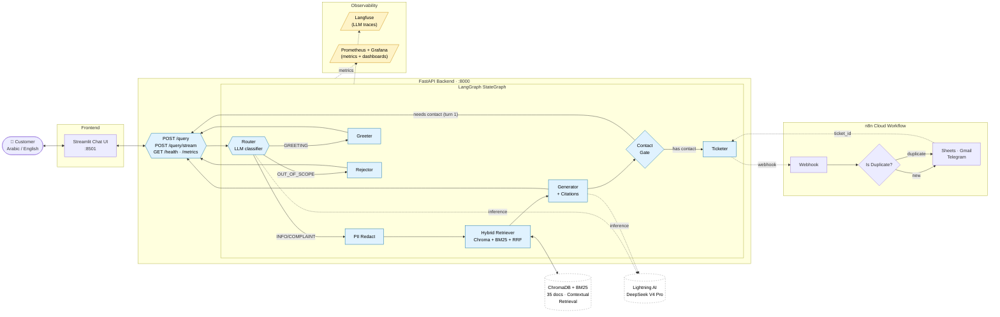

# NileTel RAG Customer Support System

> Bilingual (Egyptian Arabic + English) Retrieval-Augmented Generation system for a fictional Egyptian telecom — routes customer queries, grounds answers in a 35-doc knowledge base, and auto-creates support tickets via n8n.

**Author** — Omar Gamal ElKady · ITI Advanced AI Program · Intake 46 · May 2026
**Stack** — FastAPI · LangGraph · LangChain · ChromaDB + BM25 + RRF · DSPy · RAGAS · Streamlit · n8n · Docker

[](https://github.com/OmarGamal488/niletel-rag-support/actions/workflows/ci.yml)
[](https://github.com/OmarGamal488/niletel-rag-support/actions/workflows/release.yml)


---

## What it does

A user asks a question in Arabic or English. The system:

1. **Classifies** the intent — `INFO`, `COMPLAINT`, `GREETING`, or `OUT_OF_SCOPE`.
2. **Retrieves** relevant policy / FAQ / troubleshooting chunks from the NileTel knowledge base using hybrid search (dense + BM25 + RRF).
3. **Generates** a grounded answer with inline citations, in the same language as the question.
4. **For complaints**, collects contact info over two conversational turns, then opens a ticket through an n8n workflow that:
   - assigns a `TICKET-XXXX` id,
   - appends a row to Google Sheets,
   - emails the support agent + customer,
   - posts to a Telegram team channel,
   - detects duplicate complaints (same phone) and routes them to a separate alert.

## Architecture



## n8n Automation Workflow

When the LangGraph ticketer fires, it POSTs to a cloud n8n workflow that handles ticket persistence, dual email notifications, Telegram alerts, and duplicate detection in nine nodes:


| # | Node | Role |
|---|---|---|
| 1 | **Webhook** | Receives POST from `src/ticketer.py` |
| 2 | **Issue ticket_id** (Code) | Generates `TICKET-XXXXXXXX`, spreads request body |
| 3 | **Lookup by Phone** (Sheets) | Searches existing tickets by customer phone (Plain-text column) |
| 4 | **Is Duplicate?** (IF) | Branches on whether a ticket already exists for that phone |
| 5a | **Append row in sheet** | New ticket → 8-column row write |
| 6a | **Send a message** (Gmail) | Agent alert with red-header HTML table |
| 7a | **Customer Ack Email** (Gmail) | Green-header thank-you to the customer |
| 8a | **Notify Team** (Telegram) | HTML-formatted ticket summary to the team channel |
| 5b | **Notify Duplicate** (Telegram) | ⚠️ Warning that references the existing ticket id |
| 9 | **Response Body** | Returns `{"ticket_id": "..."}` — existing on duplicate, fresh on new |

## Features

| Category | What's in |
|---|---|
| **Routing** | LLM classifier with Pydantic structured output → 4 categories |
| **Retrieval** | Hybrid (Chroma dense + BM25 sparse) + Reciprocal Rank Fusion + LongContextReorder + optional cross-encoder reranker |
| **Advanced retrieval** | **Anthropic Contextual Retrieval** (one-sentence LLM context prepended to each chunk at ingest), HyDE mode, RAG-Fusion mode |
| **Generation** | Citations with `[N]` markers; faithfulness self-audit; PII redact-restore round trip |
| **Memory** | Per-session chat history + pending-complaint store |
| **Agents** | Triad eval (judge + audit), action agent (ReAct + Tavily web fallback), tool agent |
| **DSPy** | `BootstrapFewShot`-optimised `SupportRAG` module (`eval/dspy_compiled.json`) |
| **Streaming** | SSE endpoint `POST /query/stream` |
| **API** | FastAPI: `/query`, `/query/stream`, `/health`, `/metrics`, `/stats`, `DELETE /history/{sid}` |
| **Frontend** | Streamlit chat UI with sidebar (provider / retrieval-mode toggles), source cards, ticket badge, RAGAS panel |
| **Automation** | n8n workflow (8 nodes) with duplicate detection + dual email + Telegram alerts |
| **Observability** | Langfuse (LLM traces) + Prometheus (metrics) + Grafana (8-panel dashboard) |
| **Testing** | pytest suite — router / retriever / ingestion / graph / API / contact / memory / tracer |
| **CI/CD** | GitHub Actions — ruff lint, pytest, Docker build smoke, GHCR publish on tag |
| **Demo tooling** | Cloudflare Quick Tunnel script (no ngrok warning page) |

## Quickstart

### Prereqs

- Python 3.13+
- [uv](https://docs.astral.sh/uv/) (`curl -LsSf https://astral.sh/uv/install.sh | sh`)
- An LLM provider key — Lightning AI / Groq / DeepSeek (any OpenAI-compatible chat endpoint)
- *(optional)* n8n cloud workflow for ticketing, Tavily key for web fallback

### Local (uv)

```bash
git clone https://github.com/OmarGamal488/niletel-rag-support.git
cd niletel-rag-support
uv venv && source .venv/bin/activate
uv sync

cp .env.example .env       # then fill in keys

# Build the index (Chroma + BM25 + optional Contextual Retrieval)
uv run python -m src.ingestion

# Start the API + UI in two terminals
uv run uvicorn api.main:app --host 0.0.0.0 --port 8000 --reload
uv run streamlit run app/streamlit_app.py
```

Open <http://localhost:8501>.

### Docker

```bash
# First time — also runs the ingest job into a named volume
docker compose --profile ingest run --rm ingest
docker compose up -d --build

# Logs
docker compose logs -f api
```

UI at <http://localhost:8501>, API at <http://localhost:8000>, Swagger at `/docs`.

### Public demo URL

ngrok's free tier shows an interstitial warning page on first browser visit. Cloudflare's Quick Tunnel does not — use:

```bash
./scripts/demo_tunnel.sh ui      # tunnels Streamlit on :8501
./scripts/demo_tunnel.sh api     # tunnels FastAPI on :8000
```

(See script header for `cloudflared` install instructions.)

## Knowledge base

`data/raw/` holds 35 Markdown documents (~140 KB) covering FAQs, escalation matrices, fiber/5G troubleshooting, NTRA regulations, VIP / golden-customer SLAs, NileTel Eid + Ramadan + back-to-school offers, contract cancellation, and supervisor-only goodwill credit policy. Documents are bilingual — most chunks contain a mix of Egyptian Arabic and English.

Re-run `python -m src.ingestion` after editing any file in `data/raw/`. With `CONTEXTUAL_RETRIEVAL=true`, the ingester prepends an LLM-generated one-sentence context to each chunk before embedding (Anthropic Contextual Retrieval, Sep 2024).

## Evaluation

A 11-question evaluation set (`eval/ragas_testset.json`, bilingual, covers all 4 categories) was run via `src/evaluator.py`. Latest report at `eval/ragas_report.json` (provider: Lightning AI · `deepseek-v4-pro`):

| Metric | Score |
|---|---|
| Routing accuracy | **1.00** |
| Retrieval hit-rate | 0.71 |
| Faithfulness | 0.57 |
| Answer relevancy | 0.62 |
| Context precision | 0.54 |
| Context recall | 0.60 |

These are pre-Contextual-Retrieval numbers; the index was rebuilt with Contextual Retrieval on after this report. A fresh evaluation pass is the natural next step.

## Testing

```bash
uv run pytest tests/ -v         # unit (all mocked, no live LLM)
uv run pytest tests/test_api.py # API integration with mocked graph

# End-to-end against running infra
uv run python scripts/test_n8n.py            # smoke-test n8n webhook
uv run python scripts/test_integration.py    # two-turn flow vs FastAPI
```

CI runs ruff + pytest + Docker build smoke on every push (see `.github/workflows/ci.yml`).

## Observability

Two layers, both optional:

- **Langfuse** — LLM tracing for every router / generator / contact-parser call. Toggle via `LANGFUSE_ENABLED`.
- **Prometheus + Grafana** — infra metrics + custom RAG metrics (cache, retrieval latency, per-node latency, PII redactions, query categories). Bring up with:
  ```bash
  ./scripts/start_demo.sh obs        # docker compose up
  ./scripts/start_demo.sh obs-stop
  ```
  Grafana on <http://localhost:3001>, Prometheus on <http://localhost:9090>.

## Configuration

All settings flow through `src/config.py` (Pydantic-settings + `.env`). Notable knobs:

| Var | Purpose |
|---|---|
| `LLM_PROVIDER` | `lightning` \| `groq` \| `deepseek` |
| `CONTEXTUAL_RETRIEVAL` | Anthropic-style contextual chunking on ingest |
| `LONG_CONTEXT_REORDER` | Reorder retrieved chunks to head + tail |
| `RERANKER_ENABLED` | bge-reranker-v2-m3 cross-encoder (≈6 s/query on CPU — keep off without GPU) |
| `RETRIEVAL_MODE` | `hybrid` \| `hyde` \| `rag_fusion` |
| `PII_REDACTION_ENABLED` | Strip + restore phone/email/national-id |
| `SEMANTIC_CACHE_ENABLED` | Embedding-based query cache |
| `TRIAD_EVAL_ENABLED` | Faithfulness audit on every answer |
| `TOOL_AGENT_ENABLED` | ReAct action agent with Tavily fallback |
| `LANGFUSE_ENABLED` / `PROMETHEUS_ENABLED` | Observability toggles |
| `N8N_WEBHOOK_URL` | Cloud n8n webhook for ticket creation |

See `.env.example` for the full list.

## Project structure

```
niletel-rag-support/
├── api/                 FastAPI app, schemas, deps
├── app/                 Streamlit UI + HTML components
├── data/raw/            35 KB markdown docs
├── eval/                RAGAS testset + report + DSPy compiled artefact
├── infra/observability/ Prometheus + Grafana docker-compose
├── scripts/             demo launcher, tunnel, n8n smoke / setup, integration test
├── src/                 ingestion, retriever, router, nodes, graph,
│                        contact, memory, pii, ticketer, observability, tracer,
│                        evaluator, triad_eval, dspy_module, cache, tools, agent
├── tests/               pytest unit + integration
├── .github/workflows/   ci.yml + release.yml
├── Dockerfile           multi-stage: base → deps → source → {api, streamlit}
├── docker-compose.yml   ingest + api + streamlit services
└── CLAUDE.md            engineering notes / runbook
```

## Acknowledgements

Built as the final project for the **ITI Advanced AI Program — Intake 46** (Information Technology Institute, Egypt, May 2026).

Knowledge base content, customer scenarios, and the NileTel brand are fictional; any resemblance to real telecom products or policies is coincidental.

## License

MIT.
